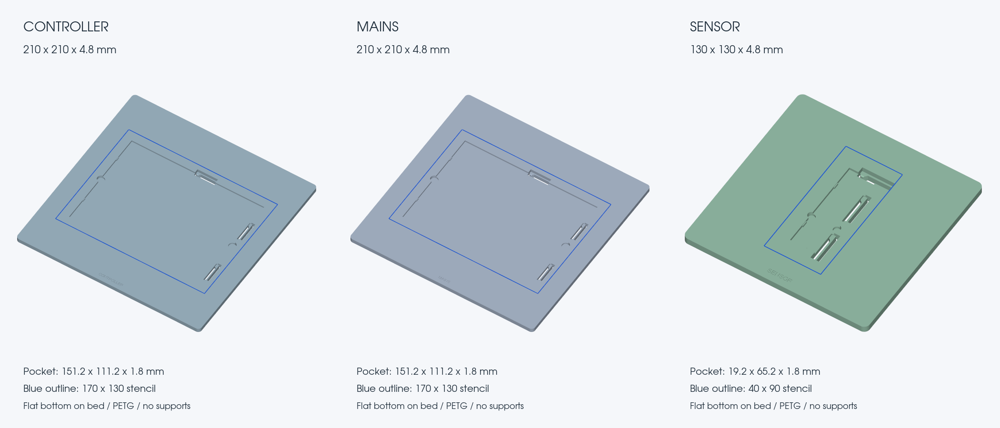
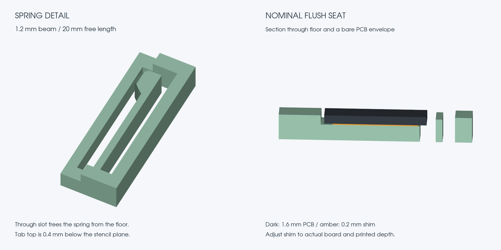

# PCB stencil fixtures

Three square PETG trays for the ordered bare PCBs, with a flat stencil/tape
surface, oversized pocket, three locating pads and three flexible edge tabs.
Source uses **CadQuery 2.8 + uv**, the same approach as `../cat-water-cover`.
All dimensions are millimetres. STEP, STL and geometry-only 3MF exports are
already oriented flat on the bed, pocket upward, at Z=0.



## Print files

| PCB | Tray STEP | Outer size | Pocket, before locating features | Ordered custom stencil |
| --- | --- | --- | --- | --- |
| Controller | [controller-tray.step](output/controller-tray.step) | 210 × 210 × 4.8 | 151.2 × 111.2 × 1.8 | 170 × 130 |
| Mains | [mains-tray.step](output/mains-tray.step) | 210 × 210 × 4.8 | 151.2 × 111.2 × 1.8 | 170 × 130 |
| Sensor | [sensor-tray.step](output/sensor-tray.step) | 130 × 130 × 4.8 | 19.2 × 65.2 × 1.8 | 40 × 90 |

Each has matching `.stl` and `.3mf` files in `output/`. The two large trays have
the same fit geometry and different recessed names. One large tray can serve
both PCBs if doing them in sequence. There are also three separately exported
`*-shim-0.2mm.step`, `.stl` and `.3mf` sheets for nominal height adjustment.
The shims are optional print files: measured thin sheet material works too.

The centred stencil has 20 mm minimum border beyond its edges: 20/40 mm in
X/Y for the large trays, 45/20 mm for the sensor. The tray does not locate or
recess the stencil. Align its apertures visually to the pads and tape onto the
flat border. The blue lines are preview annotations, not printed grooves.
The purchase listing's 380 × 280 mm stock size is recorded separately from its
custom cut sizes in the [order record](../../bom/purchases/W2026091502305469/README.md).
Actual aperture centring within each supplied sheet is unmeasured.

## Material and slicer settings

**Use ordinary PETG**, with a 0.4 mm nozzle. The broad tray should stay firm
under a squeegee; flexibility is concentrated in the thin tabs. PETG has useful
toughness and some flexibility ([Prusa material guide](https://help.prusa3d.com/article/petg_2059)).
TPU would make the entire support more compliant and is not the selected
material. PLA may work, but the spring design has not been checked with PLA.

- Print one tray flat, pocket up, at **100% scale**. No supports or raft.
- Use **0.20 mm layers**, including the first layer, **4 walls**, **5 top and
  5 bottom layers**, and about **25% gyroid infill**. Select your filament's
  normal PETG temperature/flow profile.
- The 1.2 mm beams are three nominal nozzle widths. Inspect the sliced preview
  to ensure continuous walls in each beam and clear slots. Keep automatic
  supports off and prevent brims from filling the internal spring slots.
- Use a clean, flat build plate. Use an external brim only if your PETG profile
  needs it; remove it fully. Keep the tray on a hard, flat bench during pasting.
- Remove strings and any raised top-surface defects. Do not round the seating
  plane or datum pads. Check the tray does not rock and the pocket floor is flat.
- Print a nominal shim separately as **one 0.20 mm layer**, 100% solid, no brim
  or ironing. Its actual thickness still needs checking; a calibrated sheet is
  preferable if first-layer variation makes the printed shim uneven.

The 210 mm tray fits the smaller 235.5 × 256 mm nozzle envelope used by the
cat-water-cover project. No printer preset or sliced toolpath is embedded in
these exports. This is an ambient-temperature paste fixture; lift the PCB out
before hot-bed/reflow work.

## Flush height and use

All three PCB orders specify **1.6 mm nominal thickness**. JLCPCB publishes
1.44–1.76 mm for this thickness ([capabilities](https://jlcpcb.com/capabilities/pcb-capabilities)).
The **1.8 mm pocket** allows a shim under even a thicker board. A nominal
1.6 mm board plus a **0.2 mm shim** brings its top to the 4.8 mm tray surface.
The stencil foil sits on top of both surfaces; its thickness is not added to
the pocket depth.

1. Clean the bare PCB and tray. Before any paste, measure the PCB thickness
   and the actual printed pocket depth.
2. Select a broad, flat shim: **shim thickness = pocket depth − PCB thickness**.
   For the nominal model, the published board tolerance needs 0.04–0.36 mm.
   Use measured polyester/Kapton sheet or evenly stacked thin paper if the
   supplied 0.2 mm print is not right. Cover the support floor broadly; avoid
   small stacks at isolated points that let the board bend under the squeegee.
3. Set the shim on the floor, clear of the spring slots. Lower the PCB against
   the left and bottom datum pads. Gently pull the right/top tabs outward as
   needed; their bevels assist insertion. They press on the edges, with no lip
   over the board. Do not force a board through a tight or fused slot.
4. Lay a straightedge across the tray and PCB in several directions. Adjust
   until they are coplanar, without a visible step or a gap beneath the stencil
   at the paste openings. Target within approximately 0.05 mm; the printed shim
   alone does not establish this. If the bare PCB stands proud without any shim,
   deepen/regenerate the pocket rather than force the stencil flat.
5. Visually align the stencil and tape a hinge along one edge. Tape the opposite
   edge after checking alignment. Place tape outside the PCB/paste field and
   away from the moving tabs. Confirm the PCB cannot shift in a dry pass.
6. Squeegee toward the fixed left/bottom pads so the stroke pushes the PCB into
   its stops. Lift the stencil on the tape hinge, then lift the PCB through
   the two small edge wells with a plastic pick while easing the tabs back.
   The wells expose an underside edge without making large holes under the PCB.

Paste all three boards **before through-hole parts or the sensor pigtail**.
These fixtures are for the single top-side bare-board pass in the
[assembly guide](../../docs/assembly/README.md).



## Fit features

- Pocket clearance is 0.6 mm per side, with square inside corners to accommodate
  the released sharp rectangular board outlines and unspecified sensor deburring.
- Two left pads and one bottom pad establish position. Two right springs and
  one top spring press the board against those pads.
- Each spring has a 1.2 mm beam, approximately 20 mm free length, 0.6 mm nominal
  preload and 1.2 mm checked lateral free travel. The ordered ±0.2 mm outline
  tolerance requires 0.4–0.8 mm nominal deflection. Remaining travel provides
  adjustment margin, not a guarantee of printer accuracy or holding force.
- Slots extend through the tray, so the floor does not lock the springs in
  place. Everything grows upward from the bed without a suspended underside.
- Tabs and datum pads finish 0.4 mm below the stencil-support plane. Text is
  recessed. There are no locating pins through stencil holes or PCB mounts.
- The 3 mm floor and broad shim support the bare PCB during squeegee pressure.

## Rebuild and review

```sh
cd cad/stencil-fixtures
uv sync --locked
uv run python build.py
uv run python validate.py
uv run python render.py
```

`build.py` owns all dimensions. If revising `DEPTH` for a measured board, retain
layer-compatible heights and review `SHIM`, the nominal shim filenames, the
validator's thickness/shim limits and the section preview together. Rerun all
three commands after a geometry change.
`output/parameters.json` binds dimensions to the order and released outline
Gerber hashes. `output/validation.json` binds the exported print geometry to its
source and dependency lock. [review.json](output/review.json) records this
release's independent and visual review; changed source/exports invalidate its
hashes and need another review.

The validator reloads STEP files, checks single valid solids and watertight
STL/3MF meshes, compares nominal source/export geometry, checks all 27 combinations
of board length/width/thickness per tray, checks spring clearance and intentional
preload, rejects an oversize-board negative control, checks shim clearance and
removal, and checks that consecutive 0.2 mm layer sections need no overhang
support. Spring displacement checks translate the free beam envelope; they are
not finite-element analysis. The simple maximum beam-strain estimate is 0.54%,
without a material strength or fatigue claim.

The previews render the exported STEP solids. PCB blanks and blue stencil
outlines are labelled nominal envelopes. Physical fit, retention force, print
flatness and paste results remain untested until the boards arrive. The
supplier-selected stencil foil thickness also remains unconfirmed; the earlier
0.10 mm paste review is a design basis, not evidence of the delivered foil.

**2026-09-14 review:** all six STEP/STL/3MF parts passed, with 81 PCB tolerance
cases across the three trays. Independent review found and closed a sensor
access-well/spring conflict; final renders were inspected. `sh scripts/check.sh`
passed, with its 43 conditional native integration checks skipped by the normal
harness. No native PCB file changed, and no electrical review or physical test
is claimed by this fixture work.
