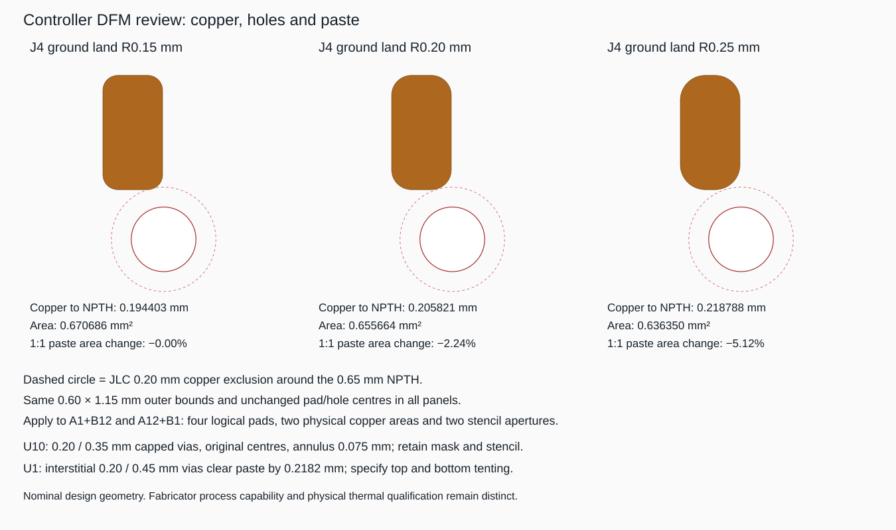

# Controller fabrication and routing contract

The controller uses **JLC04161H-7628**, four layers, nominal 1.6 mm FR4,
1 oz outer / 0.5 oz inner copper, NP-155F / Tg155 material basis, green mask and
ENIG. USB is a 90 ohm differential pair with explicit **81-99 ohm acceptance**.
U10 uses eight **0.20/0.35 mm epoxy-filled, copper-capped through vias**. U1 uses
four **0.20/0.45 mm tented ground vias** with no added paste apertures.

These are reviewed design choices for native layout. They are not fabricated
measurements or an accepted board order. The [augmentation declaration](../../pcb/controller/design/kicad-augment.json)
records application and verification obligations; every native operation still
needs saved-board evidence. No routing, detailed stackup or thermal/paste
augmentation is complete merely because it appears in that declaration.

## Stack and USB geometry

The selected vendor template is `30726297697b4c18a0946278a48fb7d8`, displayed as
`JLC04161H-7628(Standard/Finished thickness1.59mm±10%)`. Its nominal 1.6 mm ordering
selection is distinct from the separate “No requirement” template. The retained
[template data](evidence/controller-stackup/selected-stackup.json) identifies it.

| Layer | Nominal thickness | Purpose |
| --- | ---: | --- |
| F.Cu | 0.035 mm | Components, signals, local ground/power |
| Pressed 7628 prepreg | 0.21040 mm, Er 4.4 | USB reference spacing |
| In1.Cu | 0.0152 mm | Continuous GND |
| Core | 1.065 mm, Er 4.6 | Symmetric four-layer core |
| In2.Cu | 0.0152 mm | Power and limited routing |
| Pressed 7628 prepreg | 0.21040 mm, Er 4.4 | Bottom spacing |
| B.Cu | 0.035 mm | Ground/thermal spreading and limited routing |

Do not rescale the pressed dielectric to force an exact 1.600 mm sum. The vendor
line solver uses **0.04064 mm finished outer copper**, while the stack table uses
nominal copper. Board thickness includes manufacturing tolerance and mask.
[JLC stackups](https://jlcpcb.com/impedance) and
[calculator guide](https://jlcpcb.com/help/article/user-guide-to-the-jlcpcb-impedance-calculator)
are the fabrication references.

Use a coated coplanar differential pair on F.Cu over uninterrupted In1.Cu GND:
**0.24 mm trace width, 0.15 mm pair gap, 0.50 mm clearance to grounded copper on
both sides**. The pair plus side clearances occupies 1.63 mm. The reserved 3 mm
corridor leaves 0.685 mm per side for ground rails. Stitch those rails with
0.30/0.60 mm vias at a project starting pitch no greater than 5 mm.

The [actual vendor request and response](evidence/controller-stackup/selected-usb-calculation.json)
return **89.942796 ohms** for that uniform line. The model is
`DiffCoatedCoplanarWaveguideWithLowerGnd1B`; all submitted dimensions are in mil,
including H1=0.2104/0.0254, W1=0.24/0.0254, W2=W1-0.5, S1=0.15/0.0254,
D1=0.50/0.0254 and T1=1.6. Its mask inputs are C1=C3=1, C2=0.6 and CEr=3.8.
The guide's older mask/taper settings produce
[89.813843 ohms](evidence/controller-stackup/older-guide-settings-usb-calculation.json).
Neither nominal result bounds production variation or pad/device discontinuities.

Route J4 through U9 and U8 to R44/R45 and the module without long branch stubs.
Merge the duplicate connector data contacts immediately, keep the long pair on
F.Cu, and use symmetric pad transitions. The project mismatch target is at most
0.5 mm. A necessary layer change requires a new line model and paired ground
return vias. These implement the
[Espressif USB guidance](https://docs.espressif.com/projects/esp-hardware-design-guidelines/en/latest/esp32c6/pcb-layout-design.html#usb).

JLC's [laminate article](https://jlcpcb.com/help/article/multi-layer-pcb-standard-laminated-structures)
and [capability page](https://jlcpcb.com/capabilities/pcb-capabilities) describe
different default/free impedance tolerances. Retain explicit 81-99 ohm acceptance
in the manufacturing requirements. Do not infer it from a default checkbox.

## USB locator correction

The stock-derived R0.15 ground-pad corners left only **0.194403 mm** to J4's
0.65 mm locating holes, below JLC's published 0.20 mm NPTH-to-copper minimum.
Use **R0.25** on A1+B12 and A12+B1, yielding **0.218788 mm**. Preserve every pad
centre, 0.60 x 1.15 mm bound and locating hole. GCT does not specify the corner
radius; this is an explicit project DFM adaptation of its
[USB4105 B4 drawing](https://gct.co/files/drawings/usb4105.pdf).

There are four logical pad objects but two physical ground areas and two stencil
apertures. Each area changes from 0.670686 to 0.636350 mm², a 5.12% reduction.
At a 0.100 mm stencil, matching nominal paste volume is 0.063635 mm³ per area.
Shared VBUS and separate signal pads retain their existing geometry. Native
initial rules enforce 0.20 mm hole-to-copper spacing without a subminimum waiver.

## Thermal copper and vias

**U2 AP63203:** reserve bottom GND beneath source X=-32..-2, Y=-5..15 mm,
600 mm² before clearances, connected to the wider ground plane. Place at least
two 0.30/0.60 mm GND vias beside each C1/C2/C3/C4/C7 ground land and two near
U2 pin 4. Keep SW compact and FB tied to the quiet output-capacitor node. There
is no exposed ground pad to invent under U2.

At 3.3 V, 0.6 A and the 80% efficiency allowance, total converter loss is
**0.495 W**. Allocating all of that assumed loss to U2 is conservative within
that assumption, not a guaranteed loss maximum. Diodes recommends 2 oz copper;
this 1 oz layout needs its own thermal acceptance. The
[AP63203 datasheet](https://www.diodes.com/datasheet/download/AP63200-AP63201-AP63203-AP63205.pdf)
quotes 89°C/W on a single-layer, 2 oz minimum-land fixture. Reusing it only as
a sensitivity example gives 94.1°C at 50°C air. Meeting the more restrictive
125°C thermal-design ceiling at that power/ambient requires an actual effective
thermal resistance below 151.5°C/W. Neither calculation measures this board.

**U10 TPS259470:** allocate at least 25 mm² of useful bottom copper to each
IN and OUT net, broad top escapes and 2 mm power spines except short reviewed
pad necks. Review continuous current capacity for at least 1.5 A. Keep programming
ground out of IN/OUT and TVS current loops, joining near GND pin 8.

The eight filled/capped vias have 0.20 mm drills and 0.35 mm copper diameters,
with a 0.075 mm annulus. In native footprint-local coordinates, pin 5 IN uses
x=-0.25 and pin 6 OUT uses x=+0.25; each has y=-0.75, -0.25, +0.25, +0.75 mm.
The [actual source-polygon clearance calculation](evidence/controller-stackup/via-clearances.json)
records 0.150 mm inter-net via copper, 0.175 mm to other source copper,
0.125 mm from control mask openings to via copper and 0.225 mm from drills to
opposite-net via copper. These are nominal geometry checks awaiting native DRC.

Each via's copper extends 0.025 mm beyond its original power land, inside the
unchanged +0.05 mm NSMD opening. Retain the
[TI RPW0010A](https://www.ti.com/lit/ds/symlink/tps25947.pdf) 0.100 mm stencil
and split 1.06 x 0.28 mm R0.05 power windows. Add no circular mask or paste
apertures. Specify epoxy fill and copper cap, not tenting or ink plugging.
The 0.20 mm drill avoids the conflict between newer 0.15 mm capability claims
and the [older POFV/aspect-ratio contract](https://jlcpcb.com/blog/via-in-pad-design-deep-dive).
Aspect ratio is 7.95 nominal and 8.745 at maximum selected board thickness.

Normal U10 loss screens at 27.9 mW using the 740 mA service allocation, 45 mΩ
and the quiescent allowance. A short at 5.3675 V and 1.280 A is about **6.87 W
while limiting**. Normal conduction loss does not close startup, short, retry
or OV recovery behavior. The datasheet's thermal fixtures are not measurements
of this layout.

**U1 ESP module:** retain nine separate 0.8 mm ground lands and paste apertures.
Use four 0.20/0.45 mm GND vias at native x=-2.130/-0.880 and
y=-3.165/-1.915 mm, plus close returns at perimeter GND pins 1 and 28. The
interstitial drill-to-paste gap is 0.218198 mm; drill-to-existing-mask-opening
gap is 0.147487 mm. Specify top/bottom tenting and no added apertures. Do not
substitute ink plugging at this proximity under
[JLC's covering rules](https://jlcpcb.com/help/article/pcb-via-covering).
Preserve the [Espressif land pattern and antenna exclusion](https://www.espressif.com/sites/default/files/documentation/esp32-c6-wroom-1_wroom-1u_datasheet_en.pdf).

## Application and evidence still owed

Apply and query the saved native stack, impedance/net classes, zones, via nets,
mask/paste, keepouts and route geometry. Measure useful copper after clearances,
preserve the USB reference and account for U10 power-via antipads. Inspect the
stencil as physical aperture unions, including shared USB contacts.

Final-board commissioning still covers minimum-input/full-load regulation,
closed-enclosure radio heating, the 50°C internal-air limit, U10 fault cycling,
USB operation and actual manufacturing process. The approximate 2.8 W controller
power screen excludes other enclosure loads and does not prove ambient temperature.

The independent review used the retained
[primary-source hashes](evidence/controller-stackup/review-sources.json) and
[research-source hashes](evidence/controller-stackup/research-sources.json).
Raw downloaded PDFs/HTML and solver captures remain in
`/tmp/crystal-shim-controller-stackup-research` and
`/tmp/crystal-shim-stackup-adversarial`. The checked-in extracts preserve selected
numeric evidence; they are not an assertion that every external document is
archived in this repository. No fabrication or operating release gate passes here.
