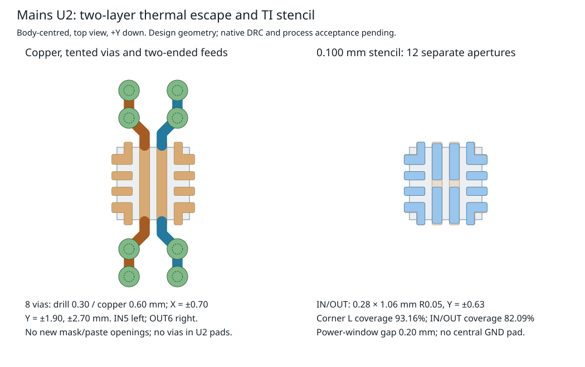

# Mains eFuse thermal and stencil contract

Use separate top/bottom **IN5 / V5_RAW** and **OUT6 / V5_PSU** copper, eight
**0.30/0.60 mm external tented through vias**, and TI's **0.100 mm stencil** for
mains U2 `TPS259470ARPWR`. This is a concrete native-layout proposal for the
final **135 x 75 mm, two-layer, nominal 1.6 mm** board. It changes no source
land, placement or net. Native application, transient qualification and final
assembly measurements remain required; this document is not fabrication approval.
Independent adversarial review of this proposal is still pending at session wrap.

The [operation parameters](evidence/mains-thermal-stencil/recommended-operations.json)
are intended for the mains augmentation declaration. Their coordinates are
U2 body-centred, top view, **+X right, +Y down**, transformed by the native
footprint pose. Current source placement is `(-21,-27)`, rotation 0, top side;
source Y increases upward. IN and OUT are functional power lands, never a
ground pad or a common heat-spreading net.

## Loss and transient allocation

The [mains budget](mains-design-basis.md#isolated-supply-and-power-budget) allocates
850 mA: coil 110, controller buck 635, sensor 30 and reserve 75 mA. The
[protection network](power-protection-review.md) supplies both coil and controller.
Normal input is 4.6375-5.3625 V at 0-50°C enclosure air. At the upper input,
`I² × 0.045Ω + VIN × 610µA` gives **35.784 mW** device loss and **38.25 mV**
conduction drop. The 45 mΩ limit is specified at 3 A; its use at 850 mA remains
a loss model, not an additional guaranteed test point.

TI specifies a 125°C recommended junction ceiling. Its 41.7 and 74.5°C/W
figures both use **four-layer** simulation boards; the former has eight vias
under the device and the latter none. Neither belongs to this two-layer layout.
For perspective only, even assumed effective resistances of 150 and 300°C/W
give 55.37 and 60.74°C junction at 50°C air under the normal model. The limiting
effective value for 125°C would be 2096°C/W. These calculations show why
steady conduction is a small load; they do not predict board temperature.
[TI Rev C, §§6.3-6.5](https://www.ti.com/lit/ds/symlink/tps25947.pdf).

Use the existing **150 µF maximum equivalent startup-capacitance allocation**,
including local C4, controller input and reflected converter-output charging.
For a linear output ramp of slope `s`, an assumed 850 mA constant load and
`C = 150 µF`, the calculated current is `I = 0.85 + C × s` and device energy is
`E = C × VIN²/2 + 0.85 × VIN²/(2s) + VIN × IQ × VIN/s`.

| Ramp model at 5.3625 V | Rise time | Total current | Peak loss | Energy |
| --- | ---: | ---: | ---: | ---: |
| Slow, 0.14854 V/ms | 36.102 ms | 0.87228 A | 4.6809 W | 84.554 mJ |
| Nominal, 0.42553 V/ms | 12.602 ms | 0.91383 A | 4.9037 W | 30.918 mJ |
| Fast, 0.77425 V/ms | 6.926 ms | 0.96614 A | 5.1842 W | 17.964 mJ |

The slow ramp has the largest energy; the fast ramp has the largest current
and peak power. The latter retains **77.67 mA** below the existing 1.04381 A
minimum-limit model. Scaling TI's typical ramp equation by its dVdt-current
range and 5% C5 tolerance is an engineering envelope. A buck starting into a
constant-power load can violate the assumed current profile at low voltage.
Verify the 150 µF and current-versus-voltage allocations before treating these
as bounds for the final circuit. TI's startup-energy method and typical thermal
shutdown plots support screening, but are not a transient thermal-impedance or
safe-operating-area guarantee for this PCB. [TI §§8.2.2.3 and Figures 6-36/6-37](https://www.ti.com/lit/ds/symlink/tps25947.pdf).

With the current settled at the maximum **1.27992 A** model and output shorted,
loss is **6.8668 W** at the normal input ceiling, or **68.668 mJ per 10 ms**.
At the highest calculated static OVLO threshold, 5.927 V, it is **7.5897 W**.
A **6.75 V sensitivity case gives 8.6436 W**, but the IRM's OVP threshold is
not a maximum transient voltage and the eFuse's OVLO delay has no specified
maximum. These are conditional power levels, not a bounded fault waveform.
The current-limit band uses the existing resistor 0-50°C drift allocation;
extending R6 itself to 125°C changes the upper limit to about 1.2823 A and the
normal-input short screen to about **6.88 W**.

OVLO recovery bypasses the controlled ramp. If current instantly settles at
its limit and the same 150 µF/850 mA model holds, charging takes **1.871-4.150 ms**
and dissipates **6.427-11.629 mJ**, with a 5.601-6.867 W initial peak. Initial
fast-trip/current-settling behavior, parasitic inductance and actual load startup
are additional stresses. ITIMER is open; the 400 µs limit response is typical,
so it does not bound pre-limit current or energy.

Persistent shorts can invoke thermal shutdown and automatic retry. TI gives
154°C shutdown, 10°C hysteresis and 110 ms retry interval as typical values;
cooling precedes the extra retry delay. Do not use shutdown as a 125°C operating
regulator or divide one pulse by 110 ms and claim a maximum average. Merely
assuming 1, 10 or 100 ms at 6.864 W followed by 110 ms off gives 0.062, 0.572 or
3.268 W average, before cooling time. The actual on-time, cooldown, source
hiccup, repeated OV recovery and enclosure temperature require a coupled
transient assessment. [TI §§6.6, 7.3.5 and 7.3.8](https://www.ti.com/lit/ds/symlink/tps25947.pdf).

## Two-layer copper and via proposal

Select **1 oz nominal copper on both sides, green mask and ENIG**, with a
1.44-1.76 mm finished-thickness allocation for the nominal 1.6 mm order.
These are process requirements to confirm with the fabricator; do not import
the controller's four-layer stack or its effective thermal resistance.
[JLC capabilities](https://jlcpcb.com/capabilities/pcb-capabilities).

- Four vias on IN5: local X=-0.70, Y=-2.70, -1.90, +1.90, +2.70 mm.
  Four on OUT6: X=+0.70 at the same Y coordinates. Each is a plated **0.30 mm
  drill / 0.60 mm copper** through via, tented on both sides, with no added
  paste or mask aperture. Aspect ratio is 5.33 nominal and 5.87 at 1.76 mm.
- Feed **both ends** of each 0.30 x 2.40 mm power land. Each top escape is
  0.30 mm wide, from local `(±0.25,±1.10)` through `(±0.25,±1.45)` and
  `(±0.70,±1.90)` to `(±0.70,±2.70)`, with signs chosen for its net/end.
  Beyond this short escape, widen into solid copper and **2 mm minimum spines**.
  Size and review the completed path for **at least 1.7 A**, twice the full-load
  allocation; trace preference alone does not establish current capacity.
- Reserve at least **10 mm² useful connected F.Cu and 50 mm² B.Cu per power
  net**, after clearances and cutouts. The JSON provides 21 mm² top and 61.6 mm²
  bottom seed rectangles per net. Join them to the vias and wider power paths
  without thermal spokes. Area is a layout allocation, not a thermal-resistance
  guarantee. Native filled-area readback must show each minimum is achieved.
- Preserve the independent quiet GND8 island/star return for R6/C5 and the
  divider returns. Keep bypass and D2 clamp loops short. No primary copper,
  via, solder or other conductive occupancy may approach the isolated thermal
  structures within 8 mm on any layer; mask supplies no insulation credit.

These operations implement TI's IN/OUT heat-spreading and short-current-path
guidance. They omit the under-device vias TI recommends for improved voltage
uniformity and current-sense accuracy. The tradeoff is measurable but cannot
be converted into a guaranteed current-limit error: a simple 35 µm copper
model at 50°C gives **4.405 mΩ** end-to-end resistance of one long land.
Feeding both ends limits the centre-gradient model to **0.936 mV at 850 mA**;
20% reductions in both width and thickness give **1.463 mV**, or **2.925 mV
at 1.7 A**. This excludes escape/contact resistance and does not assign all
device heat to either land. Confirm endpoint balance and actual current-limit
accuracy over temperature. [TI §8.4.1](https://www.ti.com/lit/ds/symlink/tps25947.pdf).

The proposal deliberately uses external ordinary vias. Current primary JLC
guidance specifies POFV hole/aspect limits and advertises free POFV on higher
layer counts, but does **not unambiguously establish or prohibit paid two-layer
POFV**. Availability remains unconfirmed. Tenting is an explicitly documented
process for these 0.30 mm external holes; it is not epoxy filling, copper capping
or a guarantee that a hole is hermetically sealed. Do not move these vias into
paste-covered lands or substitute ink plugging without a new process/geometry
review. [POFV guidance](https://jlcpcb.com/blog/via-in-pad-design-deep-dive),
[BGA process tables](https://jlcpcb.com/help/article/bga-design-guidelines---pcb-layout-recommendations-for-bga-packages),
[via covering](https://jlcpcb.com/help/article/pcb-via-covering).

The [source receipt](evidence/mains-thermal-stencil/source-geometry.json) includes
the exact model and actual compiled U2 polygons/rectangles. Calculated minima
are **0.400 mm via copper to source copper**, **0.350 mm via copper to existing
mask openings**, **0.500 mm drill to mask**, and **0.800 mm between opposite-net
via copper**. The escape-to-other-U2-land lower bound is **0.1995 mm**, using
1 µm sampling with a conservative error deduction. These are local geometry
checks; all other parts, new routes, filled zones and fabrication variation
remain part of full native DRC.



## Initial routing allocations

Use 0.25 mm isolated control tracks, 0.15 mm ordinary isolated clearance and
0.30/0.60 mm ordinary vias. The 0.15 mm preference remains below the computed
0.1995 mm U2 escape clearance lower bound. Use 2 mm isolated power spines,
except the explicit short 0.30 mm U2 necks. The 8 mm primary/isolated and
3.2 mm distinct-primary constraints always override ordinary spacing.

Start primary routes at 2 mm width in nominal 35 µm copper. Widen J1-RV1 surge
paths to at least 3 mm where pad transitions allow, use solid joins and merge
both Sabre tails per blade. A 2 mm track has 0.070 mm² nominal cross-section;
at 50°C, a 100 mm length has about 27.5 mΩ resistance and 17.6 mW loss at the
800 mA fuse rating. This resistance screen is an engineering allocation, not
fuse-clearing, inrush or MOV surge survival evidence. Review actual routed
cross-section and the complete fault integral before fabrication. The IRM's
typical inrush peak alone does not supply the missing duration.

## Stencil and native acceptance

Retain every existing copper land and **+0.05 mm NSMD mask expansion**.
Replace all automatic U2 F.Paste and any prior footprint-owned paste shapes
with the following **12 physical apertures**. Do not overlay these on full-pad
automatic paste or add a central ground aperture.

| Lands | Apertures in native local coordinates |
| --- | --- |
| 5 and 6, IN/OUT | Two R0.05 rounded rectangles per land, width 0.28 x height 1.06 mm, X=-0.25/+0.25 respectively, Y=-0.63/+0.63 |
| 2/3 and 9/8 | One R0.05, 0.60 x 0.25 mm rectangle per land, X=-0.90/+0.90, Y=-0.225/+0.225 |
| 1/4/7/10 | One reduced L per land, five convex R0.05 corners and a sharp re-entrant corner; exact mirrored polygons are in the operation JSON |

For pin 1, the L is the union of horizontal `X=-1.20..-0.60,
Y=-0.825..-0.55` and vertical `X=-0.825..-0.60, Y=-1.20..-0.55`, with the
five convex corners rounded. This gives **93.155%** of actual source-polygon
area. IN/OUT coverage is **82.093%**, with a **0.20 mm split gap** and
**0.22 mm inter-net window gap**. Total nominal aperture area is **2.756739 mm²**;
at 0.100 mm stencil thickness, nominal wet-paste volume is **0.275674 mm³**.
These reproduce TI's rounded 93%/82% examples, not a measured transfer efficiency.
Use a laser-cut stencil and a qualified lead-free paste/reflow process.
[TI RPW0010A 4225183/A stencil drawing, PDF p74](https://www.ti.com/lit/ds/symlink/tps25947.pdf).

Before native acceptance, query pad/net/pose preservation; both layer via nets,
tenting and zone connectivity/area; complete primary/secondary spacing; quiet
ground and power-loop routing; and physical stencil aperture unions/counts.
The final thermal assessment must use the saved two-layer copper and actual
enclosure/source/load conditions, including the startup/OV-recovery/short
power-time cases above. Final-unit PWR-05 must measure rail/current transients,
retry behavior and temperature, including hot restart and 50°C internal air.
Keep these obligations open until their evidence exists.

Reproduce from the repository root:

```sh
bun docs/design/evidence/mains-thermal-stencil/collect-source.ts > /tmp/mains-u2-source.json
cmp /tmp/mains-u2-source.json docs/design/evidence/mains-thermal-stencil/source-geometry.json
python3 docs/design/evidence/mains-thermal-stencil/calculate.py --check
```

[Numeric results](evidence/mains-thermal-stencil/calculations.json) retain the
equations' inputs and geometry checks. [Primary-source receipts](evidence/mains-thermal-stencil/primary-sources.json)
identify exact revisions and downloaded bytes; raw PDFs/HTML stay in the
recorded scratch directories. No native file was emitted by this study.
