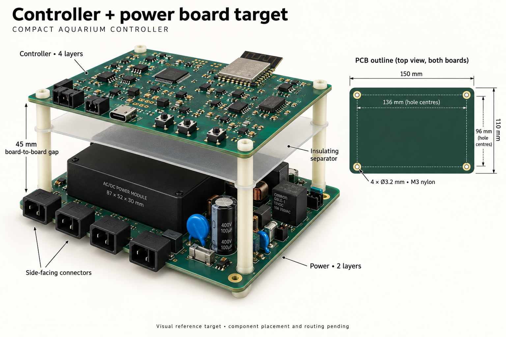

# Controller and power board visual target

Accepted design direction: 2026-09-13. The owner accepted the shared dimensions
and stacking recommendation and requested this visual reference before layout
work. This specification governs the target; the generated image illustrates
appearance and arrangement rather than exact component geometry.

## Target specification

| Feature | Target |
| --- | --- |
| Both PCB outlines | 150 × 110 mm, matching outlines, modest rounded corners |
| Top board | Controller, four copper layers, components facing upward |
| Bottom board | Power/mains, two copper layers, components facing upward |
| Board separation | 45 mm from lower PCB top face to upper PCB underside |
| Mounts | Four aligned 3.2 mm NPTH holes on each PCB |
| Hole centres | (7,7), (143,7), (7,103), (143,103) mm from upper-left, X right/Y down |
| Hole spacing | 136 × 96 mm |
| Hardware | M3 insulating screws, washers and standoffs; reserve at least 4 mm radius per mount |
| Lower-board access | Right-angle connectors mating outward at accessible edges |
| Inter-board barrier | Retained insulating separator; final material, thickness, supports and edge treatment require engineering |
| Overall appearance | Compact, orderly stack, accessible edge connectors, uncluttered service controls |

The [dimensioning study](stacked-board-target.md) records source component sizes,
candidate right-angle Sabre part numbers, routing allowances, antenna constraints,
height budget and outstanding fit checks. It remains the engineering basis for
this accepted target. These are target dimensions pending actual footprint and
assembly validation, not fabrication-ready geometry.

## Placement direction

Keep controller buttons, status indication, USB and test points accessible from
above or an edge. Place its radio antenna at an outward edge with the existing
overhang and three-dimensional keepout preserved across both boards and wiring.
Retain the controller's continuous inner ground reference and USB stack geometry.

On the power board, the retained IRM-45-12 dominates the occupied volume. Arrange
the relay, surge suppressor, fuse and buck around it while preserving primary and
isolated circuit separation. Distribute primary headers between the left and
front edges as space and separated filter wiring require; the illustration's
single front row is not a connector placement requirement. Route isolated harnesses
from a separate accessible edge. Allow mating, latch release, cable bends and
withdrawal without removing the upper PCB where practical.

Use the four mounting columns to align and support both boards. The separator
must be mechanically retained without consuming required component clearance or
obstructing connector access and airflow. Review insulation in three dimensions,
including primary wires, unused contacts, solder tails and upper-board copper.
Retain the existing 8 mm primary-to-SELV and 3.2 mm different-primary-net rules.
The previous side-by-side enclosure fit does not validate this new stack.

## Image interpretation

The image is a built-in image-generation concept, not an exported PCB assembly.
The rendered ICs, large capacitors, inductors, relay markings, connector pole
counts and copper details are illustrative and do not add or replace BOM parts.
In particular, retain the selected 5 V relay and existing power architecture;
do not copy the rendered relay's markings or extra large capacitors. Fastener
poses in perspective are approximate: use exactly the four aligned hole centres
specified above, without additional mounting holes. The drawn separator thickness
and material appearance are not an insulation rating.

The 150 × 110 mm dimension covers the PCB, not mated plugs, cable space, antenna
overhang, enclosure or the separate mains filter. The 45 mm gap does not alone
prove thermal or insulation acceptance. Confirm actual component placement,
clearances, antenna reserve, stiffness, service access and thermal margins before
fixing production geometry. No numerical 90% success probability is claimed.

## Scope and next work

This locks the visual and dimensional direction for later implementation.
No PCB source, native project, BOM or firmware is changed by this reference.
Retain the agreed circuits while compacting and moving parts, with the documented
right-angle connector substitutions subject to footprint/mating checks. Sensor
electrode redesign follows its [separate visual reference](sensor-visual-target.md).
Use the normal source, ECO, routing and verification workflow when layout begins.

## Generation brief

Built-in image generation was used with this final design brief: an industrial
reference sheet showing two matching 150 × 110 mm teal PCBs, controller above
power, four aligned nylon M3 mounts inset 7 mm, 45 mm board-face gap, retained
insulating separator, outward-facing right-angle connectors, a large enclosed
87 × 52 × 30 mm supply on the lower board, accessible buttons/USB and outward
antenna on the upper board. Include a dimensioned top-view hole pattern with
136 × 96 mm centres and 3.2 mm holes, layer-count labels and the caption
"Visual reference target • component placement and routing pending". Use a warm
white background and realistic but explicitly illustrative component detail.
