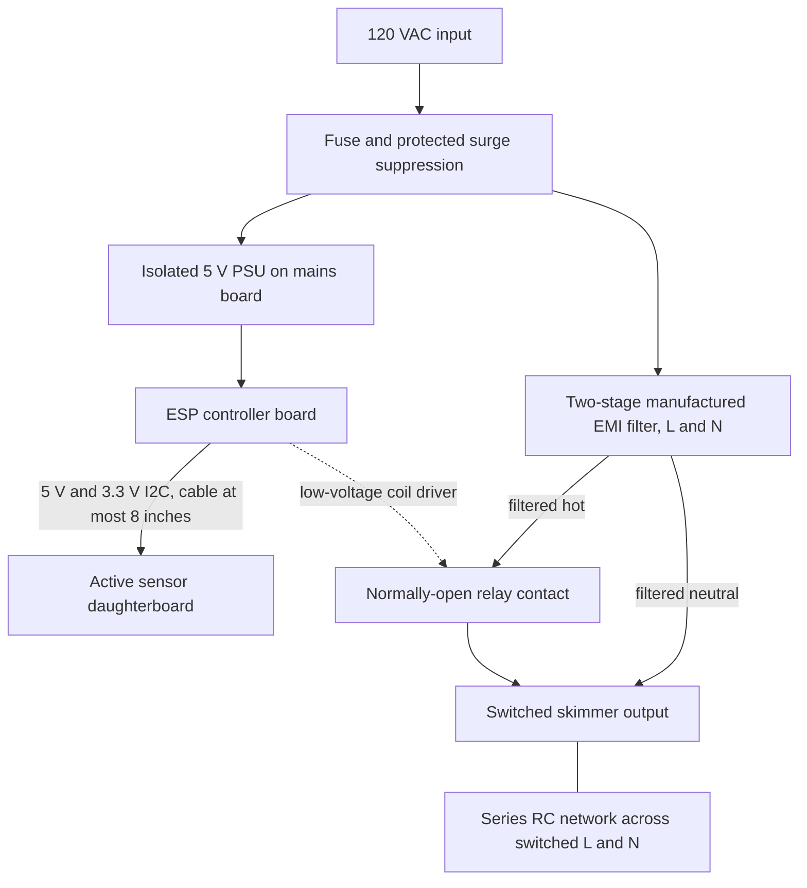

# System overview

Crystal Shim monitors aquarium water level through the outside glass and controls
an OASE CrystalSkim 350. It runs for a configurable 15 minutes a few times daily
when enough water is present. Automatic low-water stop/recovery and timed HomeKit
switch overrides are confirmed requirements. Every run ends automatically; an
explicit override can run at a valid low level. See [the control contract](controls.md).

The project targets one complete, final-use three-board build. There is no separate
sensor prototype or planned PCB revision cycle. Resolve geometry, interfaces and
component selection through reference research, calculations and design review
before fabrication; calibrate and verify actual performance on the final assembly.
See [the build sequence](build.md).

The present boards must reserve the [future refill expansion interface](design/refill-expansion.md)
before fabrication. The refill/conditioning feature and later expansion boards
remain deferred; its full specification stays in the linked Executor artifact.

The North American skimmer is specified at 120 VAC, 60 Hz, 4 W. Starting behavior
must be accounted for in relay and fuse selection from documented ratings and
design margins, then measured during final-assembly commissioning.
[OASE product specifications](https://www.oase.com/en-US/aquarium/crystalskim-350).

## Three boards

| Board | Location | Responsibility |
| --- | --- | --- |
| Sensor daughterboard | Outside aquarium glass | Continuous level electrode, wet/dry references, FDC1004, local 3.3 V regulation |
| ESP controller | Low-voltage enclosure section | ESP32-C6, 3.3 V rail, USB programming, relay driver, status LED, maintenance button |
| Mains board | Mains enclosure section | Protected input, isolated PSU, relay contacts and coil, pump output suppression |

The manufactured two-stage EMI filter sits alongside the mains board. The PSU is
always powered when mains is present, regardless of relay state. Its secondary
and the relay coil occupy a defined low-voltage region on the mains board; their
connections to the controller cross no exposed mains conductors.

PE is omitted from the functional diagram. It runs continuously to the filter case,
output earth where present, and exposed conductive parts requiring bonding. Never
switch PE. Neutral is not switched alone; the relay interrupts hot.

The ESP and sensor are galvanically isolated from mains. The pump is filtered and
switched but **not galvanically isolated** from household power. No isolation
transformer is included. USB connects to the isolated low-voltage domain only.

Moving the capacitance converter onto the sensor keeps analog capacitance traces
short. The cable carries power and digital data rather than sensitive electrode
signals. The first interface may expose LOW / NORMAL / HIGH; millimeter accuracy
is not a requirement.

No routine sensor cleaning is the acceptance goal. Outside mounting removes an
immersed mechanism but does not prove immunity to films or deposits inside the
glass. The actual aquarium and interference setup must be tested.
