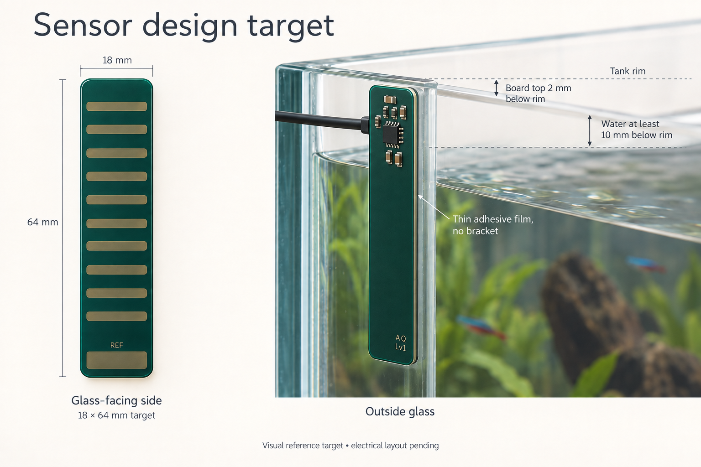

# Active sensor daughterboard

The sensor is a slim **18 × 64 mm**, four-layer, nominal 1.6 mm PCB adhered to
outside freshwater aquarium glass. The entire board sits below the rim; its top
edge is 2 mm below it. Water remains at least 10 mm below the rim. Thin, uniform
adhesive transfer film lies between mask-covered sensing copper and the existing
5 mm glass. There is no separate bracket or clip. Electronics face outward and
the cable exits left as viewed from outside the aquarium.

The image records the accepted appearance, not exact component positions or an
independently validated electrical assembly. The [design basis](design/sensor-design-basis.md)
and [source](../pcb/sensor/design/README.md) define actual copper and placement.

One FDC1004DGSR reads LEVEL on CIN1 and the wet/liquid reference on CIN2, with
stored dry baselines. CIN3/CIN4 remain unused; no processor or live dry-reference
channel is added. The fixed TPS7A2433DBVR supplies local 3.3 V. Existing firmware
channel allocation and the controller-side six-position Micro-Fit pinout remain.

The glass-facing B.Cu has ten horizontal bars per LEVEL column, connected by
narrow common-net spines. Segmentation changes physical geometry, not measurement
channel count. LEVEL spans 50 mm at board Y1..51, corresponding to 3..53 mm below
the rim. RL occupies board Y53..63, or 55..65 mm below the rim. The top 7 mm of
LEVEL therefore remains dry at the owner's highest water position. **50 mm is the
physical electrode span, not a claim of 50 mm usable calibrated water travel.**

In2.Cu carries the split driven SHLD1/SHLD2 backing copper; no ground plane
replaces it. In1.Cu provides ground and limited routing behind those shields;
F.Cu carries outward electronics and signals. Preserve the exact field/via
constraints and dielectric stack in the design basis. Avoid components, holes
or exposed solder on the glass-facing contact surface.

J1 is six outward-facing 3 × 2 mm solder lands at 3 mm pitch, replacing the
sensor's through-hole Micro-Fit header. Solder the 24 AWG pigtail there and keep
its strain relief on the outward side so cable load cannot peel the adhesive or
change the glass gap. J1 is board copper, not a purchased or pick-and-place part.
The complete harness remains at most 203.2 mm, measured from sensor solder
termination to controller crimp termination, including internal enclosure routing
and strain relief. Start I2C at 100 kHz. The [harness study](design/sensor-harness.md)
retains cable/crimp information while its old geometric route is historical.

Adhesive material/thickness, durability and actual signal margins are unmeasured.
Commission the final board after the single fabrication cycle using its actual
glass, mask and adhesive stack. Record raw LEVEL/RL, dry baselines, calibration
limits/revision, rising/falling water, wet film/deposits, temperature, adhesive
gaps or replacement, hands, cable movement and skimmer switching. Set stable
stop/restart margins before unattended use. Source checks and simulation cannot
pass those physical acceptance rows.
